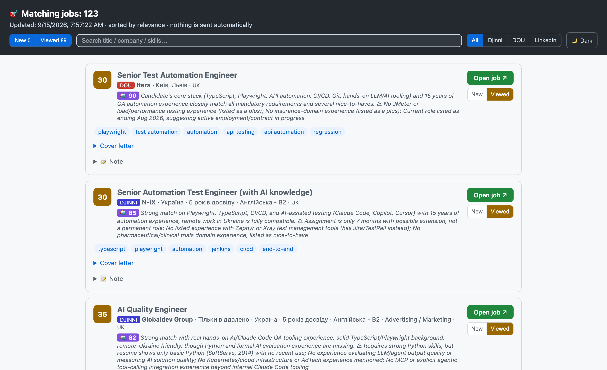

# LinkedIn Job Assistant

> 🇺🇦 [Читати українською](README.uk.md)

A local job-search helper: it watches recruiter messages in your LinkedIn inbox,
finds vacancies on DOU and LinkedIn, scores them against your resume, and prepares
ready-to-review reply/application drafts. **It never sends anything** — the final
click is always yours.



> ⚠️ LinkedIn's User Agreement restricts automated access. This tool only *reads*
> your own inbox and *drafts* replies for you — it does not auto-message or scrape
> others. Run it modestly. Use at your own discretion; LinkedIn can still flag
> automation.

## What it does

**1. Inbox assistant — `check.mjs`**
- Reads unread messages in your LinkedIn inbox
- Scores each against your skill profile
- Drafts a reply in the sender's language (🇺🇦/🇷🇺/🇬🇧)
- Flags when to attach your resume

**2. Job discovery — `jobs.mjs`**
- **DOU** — via official RSS feeds (legal, no scraping)
- **Djinni** — via the public jobs board (plain fetch, no login, no browser)
- **Jooble** — via the official Jooble API (free key, structured JSON)
- **LinkedIn Jobs** — search scraping (modest, once a day, toggleable)
- Strict gate for cold applications (score ≥ 25 + an automation role) → only on-target jobs
- Builds an application package: cover letter + link + resume path

**3. Dashboard & convenience**
- **HTML dashboard** — all jobs on one page, sorted by relevance, with per-card
  status tracking (New → Viewed), a status filter with counters, and a
  copy-letter button
- **💼 Dock shortcut** — opens the latest dashboard in one click

**4. Automation (launchd)**

| Job                | Frequency           |
|--------------------|---------------------|
| Inbox check        | hourly              |
| DOU discovery      | hourly              |
| LinkedIn discovery | once a day (10:45)  |

## Key principles
- 🔒 **Security:** your password is never stored (you log in once yourself), everything is local, no API keys
- 🚫 **No auto-send:** the scripts only prepare — you review and apply manually
- ⚖️ **Minimal risk:** DOU via legal RSS, LinkedIn scraping modest and toggleable

## One-time setup

```bash
cd ~/linkedin-assistant
npm install                      # installs playwright
npx playwright install chromium  # downloads the browser
node login.mjs                   # YOU log in manually (handles 2FA). Never stores your password.
```

`login.mjs` opens a real browser. Log in fully, then press ENTER in the terminal
to save the session into `.browser-profile/`.

## Inbox assistant — `check.mjs`

```bash
node check.mjs              # headless; UNREAD threads only
HEADFUL=1 node check.mjs    # watch it (useful when selectors break)
MAX=5 node check.mjs        # cap unread threads opened this run
SCAN_ALL=1 node check.mjs   # scan recent threads regardless of read state
```

New drafts land in `drafts/`. Each draft is a markdown file: their message, a
suggested reply, the relevance score, and an attach-resume checkbox. It never
clicks Send.

### Unread badge on the Jobs app

Each scan writes the number of unread LinkedIn message threads to
`notify-state.json`. The **Jobs app** (`Jobs.app`, "Вакансии") runs persistently
in the Dock and reads that file every few seconds, showing the count as a red
Dock badge (cleared once the threads are read on LinkedIn — the next scan
reports a lower count). Clicking the Dock icon opens the dashboard as before.

Build it with `./build-jobs.sh`, then start it at login by installing
`com.eugene.jobs-badge.plist` into `~/Library/LaunchAgents/` (see
`com.example.jobs-badge.plist.example`). `check.mjs` also relaunches it
defensively on each scan. The original AppleScript applet is preserved at
`Jobs.app.orig`.

## Djinni inbox (combined Dock badge)

The Dock badge on `Jobs.app` ("Вакансии") shows the **combined** number of unread message threads from **LinkedIn** and **Djinni**.

One-time login (whenever the Djinni session expires):

```bash
node djinni-login.mjs   # opens a browser; log in to Djinni manually (incl. 2FA)
```

Count unread Djinni inbox threads (writes `djinni-notify-state.json`):

```bash
node djinni-check.mjs              # headless
HEADFUL=1 node djinni-check.mjs    # watch it / fix selectors against the live page
```

`djinni-check.mjs` is **count-only**: it counts the conversation threads in Djinni's unread bucket (`https://djinni.co/my/inbox?bucket=unread`), never opens threads, never drafts, never sends. `Jobs.app` polls both `notify-state.json` (LinkedIn) and `djinni-notify-state.json` (Djinni) every ~3 s and badges their sum.

Run it hourly via launchd:

```bash
cp run-djinni.sh.example run-djinni.sh                      # then edit PATH/version
cp com.example.djinni-inbox.plist.example \
   ~/Library/LaunchAgents/com.eugene.djinni-inbox.plist      # then edit the paths
launchctl load ~/Library/LaunchAgents/com.eugene.djinni-inbox.plist
```

## Job discovery — `jobs.mjs`

Finds *new* vacancies, scores them against your resume, and writes an
**application package** (cover letter in the job's language + resume path) for
each strong match into `applications/`. **It never submits anything.**

```bash
node jobs.mjs              # all sources (per jobs.config.json)
DOU_ONLY=1 node jobs.mjs   # skip LinkedIn scraping (DOU + Djinni still run — fully ToS-clean)
HEADFUL=1 node jobs.mjs    # watch the LinkedIn part
```

- **DOU** — official RSS feeds (`jobs.dou.ua`), clean and structured. Edit feeds in `jobs.config.json`.
- **Djinni** — public jobs board (`djinni.co/jobs/`), read with a plain fetch (no login, no browser). Each search is a full jobs-search URL — copy them from your browser's filters. Set `djinni.enabled=false` to disable.
- **Jooble** — official Jooble API (`jooble.org/api`). Jooble is behind Cloudflare, so the API is the supported path. Needs a **free** API key from [jooble.org/api/about](https://jooble.org/api/about), set via the `JOOBLE_API_KEY` env var (in `run-jobs.sh`, gitignored — never commit the key). Searches are `{ keywords, location }` pairs in `jobs.config.json`. Set `jooble.enabled=false` to disable.
- **LinkedIn Jobs** — scrapes search results (⚠️ ToS-restricted, more detectable). Set `linkedin.enabled=false` to disable.
- Cold applications use a **high bar**: `minScore` (default 25) + `requireRole`.
- `jobs-seen.json` prevents re-preparing the same vacancy.

## Dashboard — `dashboard.mjs`

```bash
node dashboard.mjs          # rebuild applications/index.html
node dashboard.mjs --open   # rebuild and open it
```

Renders every package in `applications/` as a card, sorted by score. Per-card
status (New / Viewed) is stored in the browser's localStorage keyed by job URL,
so it survives dashboard regeneration. Opening a job link or expanding its cover
letter marks the card Viewed automatically. Use the header filter to focus on a
status.

## Tuning relevance — `skills.json`

- `skills` — keyword → weight. Higher weight = stronger match.
- `roles` — titles you'd accept (strong signal).
- `antiKeywords` — phrases that *lower* the score (e.g. "manual testing only").
- `thresholds.relevant` / `.maybe` — score cutoffs for drafting + attaching.

Job-discovery search config (feeds, LinkedIn searches, `minScore`, `requireRole`)
lives in `jobs.config.json`.

## Schedule it (launchd)

The run wrappers and launchd agents are machine-specific (absolute paths,
your resume location), so they ship as `*.example` templates. Copy each, fill in
your own values, and the real copies stay local (gitignored):

```bash
cp run.sh.example run.sh && cp run-jobs.sh.example run-jobs.sh   # then edit node version + RESUME_PATH
cp com.example.linkedin-assistant.plist.example com.you.linkedin-assistant.plist  # replace YOUR_USERNAME inside
cp com.you.linkedin-assistant.plist ~/Library/LaunchAgents/
launchctl load ~/Library/LaunchAgents/com.you.linkedin-assistant.plist
```

Unload to stop: `launchctl unload ~/Library/LaunchAgents/com.you.linkedin-assistant.plist`.
Discovery has its own templates: `com.example.job-discovery-dou.plist.example`
and `com.example.job-discovery-linkedin.plist.example`.

## When it breaks

LinkedIn changes its HTML often. If `check.mjs` finds 0 cards or can't read messages:
1. Run `HEADFUL=1 node check.mjs` and watch.
2. Open DevTools on the messaging page, find the new class names.
3. Update the `SEL` object at the top of `check.mjs`.

Session expired? Re-run `node login.mjs`.

## Project layout

```
~/linkedin-assistant/
├── check.mjs          inbox → reply drafts
├── jobs.mjs           job discovery → application packages
├── login.mjs          one-time LinkedIn login
├── djinni-login.mjs   one-time Djinni login
├── djinni-check.mjs   Djinni inbox unread count → djinni-notify-state.json
├── dashboard.mjs      HTML dashboard generator
├── lib/               logic (scoring, templates, DOU/Djinni/Jooble/LinkedIn sources)
├── skills.json        skill profile + weights
├── jobs.config.json   what and where to search
├── drafts/            reply drafts
├── applications/      application packages + index.html
└── Jobs.app           Dock shortcut 💼
```

## What's where

| File                  | Purpose                                                   |
|-----------------------|-----------------------------------------------------------|
| `login.mjs`           | One-time manual login; persists session.                  |
| `check.mjs`           | Read unread → score → draft. Never sends.                 |
| `djinni-login.mjs`    | One-time manual Djinni login; persists session.           |
| `djinni-check.mjs`    | Count unread Djinni inbox threads. Count-only, never opens threads. |
| `jobs.mjs`            | Discover vacancies → application packages. Never submits. |
| `dashboard.mjs`       | Build the HTML dashboard with status tracking.            |
| `lib/relevance.mjs`   | Local scoring (no API key, nothing leaves the machine).   |
| `lib/draft.mjs`       | Builds the reply-draft markdown.                          |
| `lib/application.mjs` | Builds the application-package markdown.                  |
| `skills.json`         | Your skill profile + thresholds. Edit freely.             |
| `resume.txt`          | Extracted from your .docx (reference).                    |
| `drafts/`             | Output — review and send these manually.                  |
| `seen.json`           | Tracks processed threads (no duplicate drafts).           |
| `jobs-seen.json`      | Tracks processed vacancies (no duplicate packages).       |

## Technologies
JavaScript (Node.js) · Playwright · DOU RSS · launchd · Swift/AppKit (icon) ·
no external dependencies beyond Playwright.

## License
[MIT](LICENSE)
