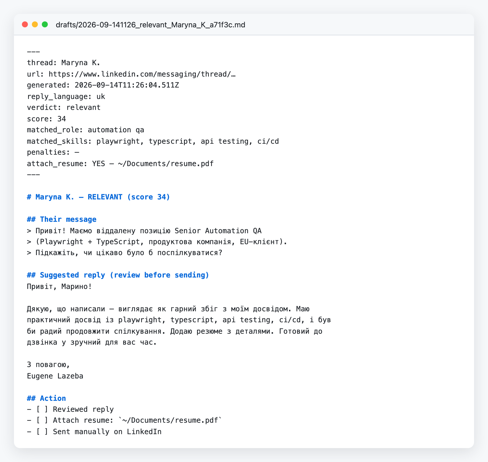
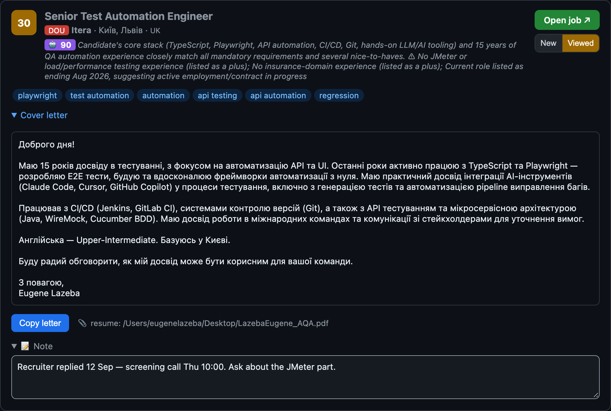
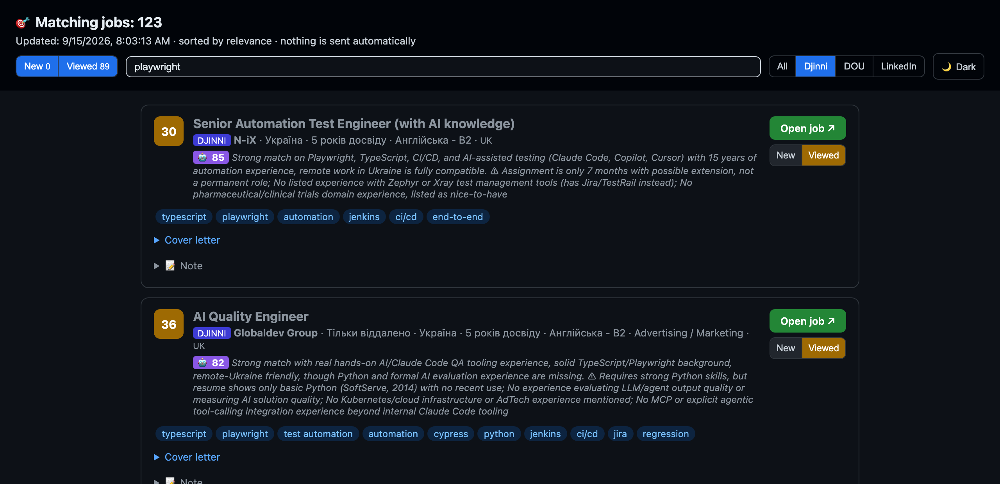

# LinkedIn Job Assistant

> 🇬🇧 [English version](README.md)

Локальний помічник у пошуку роботи: стежить за повідомленнями рекрутерів у
вашій скриньці LinkedIn, шукає вакансії на DOU та LinkedIn, оцінює їх
відповідність вашому резюме і готує чернетки відповідей та відгуків, готові до
перегляду. **Сам нічого не надсилає** — останній клік завжди за вами.


> ⚠️ Угода користувача LinkedIn обмежує автоматизований доступ. Цей інструмент
> лише *читає* вашу власну скриньку і *готує чернетки* відповідей — він не
> розсилає повідомлення і не скрейпить чужі дані. Запускайте помірно.
> Використовуйте на власний розсуд: LinkedIn усе одно може розцінити це як
> автоматизацію.

## Що вміє

**1. Асистент скриньки — `check.mjs`**
- Читає непрочитані повідомлення у вашій скриньці LinkedIn
- Оцінює кожне за вашим профілем навичок
- Готує чернетку відповіді мовою співрозмовника (🇺🇦/🇷🇺/🇬🇧)
- Підказує, коли варто прикріпити резюме

**2. Пошук вакансій — `jobs.mjs`**
- **DOU** — через офіційні RSS-стрічки (легально, без скрейпінгу)
- **Djinni** — через публічну дошку вакансій (простий fetch, без логіна, без браузера)
- **Jooble** — через офіційний Jooble API (безкоштовний ключ, структурований JSON)
- **LinkedIn Jobs** — скрейпінг пошуку (типово кожні 3 години, вимикається; поверніть раз на день для меншого ризику виявлення)
- **Склейка між джерелами** — одна й та сама вакансія на кількох дошках
  згортається в один пакет (посилання на інші джерела лишаються на картці)
- Суворий поріг для «холодних» відгуків (бал ≥ 25 + роль з автоматизації) →
  лише цільові вакансії
- Збирає пакет для відгуку: супровідний лист + посилання + шлях до резюме
- **LLM-переоцінка та персональні супровідні листи** — найсильніші keyword-збіги
  отримують другу оцінку від локального виклику `claude -p` (типово haiku):
  вердикт 0–100, один рядок «чому» і персональний супровідний лист. LLM ніколи
  не вирішує, що потрапляє в пакет — це робить keyword-бал; LLM лише ранжує,
  пояснює і пише. Будь-який збій CLI тихо відкочується до keyword-пакета.
  Потрібен `resume.txt`; налаштовується блоком `llm` у `jobs.config.json`
  (`enabled`, `model`, `maxPerRun`). Картки з LLM-оцінкою
  мають бейдж 🤖 на дашборді. Дочірній процес `claude` запускається у
  захищеному режимі — інструменти вимкнені, робоча тека поза репозиторієм —
  бо текст вакансій є недовіреним входом і не повинен читати локальні файли.

**3. Дашборд і зручності**
- **HTML-дашборд** — усі вакансії на одній сторінці, відсортовані за
  релевантністю, з конвеєром статусів (New → Viewed → Applied → Answered →
  Interview / Rejected), приватними
  нотатками, мультифільтрами, пошуком, підсвіткою нових і кнопкою копіювання
  листа
- **💼 Ярлик у Dock** — відкриває свіжий дашборд одним кліком

**4. Автоматизація (launchd)**

| Завдання           | Частота               |
|--------------------|-----------------------|
| Перевірка скриньки | щогодини              |
| Пошук на DOU       | щогодини              |
| Пошук на LinkedIn  | кожні 3 години (о :45) |

Кожен запуск `jobs.mjs` завершується macOS-сповіщенням з підсумком, плюс
окремим 🔥-банером, коли запуск записав сильний збіг (LLM-бал ≥ 70, або
keyword-бал ≥ 40, якщо LLM його не оцінював) — щоб чудова вакансія не тонула
в денному дайджесті. Перевірка здоров'я скреперів також порівнює кількість
знахідок кожного джерела з його власною недавньою історією (останні 10
запусків) і показує ⚠️-сповіщення, коли джерело приносить менше 30% своєї
недавньої медіани (медіана ≥ 5, щоб не зважати на природно маловодні
джерела) — це ловить повільну деградацію селекторів (50 → 20 → 6), а не лише
падіння до чистого 0.

## Ключові принципи
- 🔒 **Безпека:** пароль ніде не зберігається (логінитесь один раз самі), все локально, без API-ключів
- 🚫 **Жодної автовідправки:** скрипти лише готують — переглядаєте і відгукуєтесь ви
- ⚖️ **Мінімальний ризик:** DOU через легальний RSS, скрейпінг LinkedIn помірний і вимикається

## Одноразове налаштування

```bash
cd ~/linkedin-assistant
npm install                      # встановлює playwright
npx playwright install chromium  # завантажує браузер
node login.mjs                   # ВИ логінитесь вручну (з 2FA). Пароль ніде не зберігається.
```

`login.mjs` відкриває справжній браузер. Залогіньтесь повністю, потім
натисніть ENTER у терміналі, щоб зберегти сесію у `.browser-profile/`.

## Асистент скриньки — `check.mjs`

```bash
node check.mjs              # headless; лише НЕПРОЧИТАНІ треди
HEADFUL=1 node check.mjs    # дивитись наживо (корисно, коли зламались селектори)
MAX=5 node check.mjs        # обмежити кількість відкритих тредів за запуск
SCAN_ALL=1 node check.mjs   # сканувати останні треди незалежно від статусу прочитання
```

Нові чернетки з'являються у `drafts/`. Кожна чернетка — markdown-файл: їхнє
повідомлення, запропонована відповідь, бал релевантності та чекбокс «прикріпити
резюме». Кнопку «Надіслати» він не натискає ніколи.



### Бейдж непрочитаного на застосунку Jobs

Кожне сканування записує кількість непрочитаних тредів LinkedIn у
`notify-state.json`. **Застосунок Jobs** (`Jobs.app`, «Вакансии») постійно
працює в Dock, читає цей файл кожні кілька секунд і показує кількість червоним
бейджем на іконці (він зникає, щойно треди прочитано на LinkedIn — наступне
сканування поверне менше число). Клік по іконці в Dock відкриває дашборд, як і
раніше.

Зберіть його через `./build-jobs.sh`, потім увімкніть автозапуск при вході,
встановивши `com.eugene.jobs-badge.plist` у `~/Library/LaunchAgents/` (див.
`com.example.jobs-badge.plist.example`). `check.mjs` також перезапускає його
про всяк випадок при кожному скануванні.

## Скринька Djinni (спільний бейдж у Dock)

Бейдж на `Jobs.app` («Вакансии») показує **сумарну** кількість непрочитаних
тредів з **LinkedIn** та **Djinni**.

Одноразовий логін (щоразу, коли сесія Djinni закінчується):

```bash
node login.mjs djinni   # відкриває браузер; залогіньтесь на Djinni вручну (разом із 2FA)
```

Підрахунок непрочитаних тредів скриньки Djinni (пише у `djinni-notify-state.json`):

```bash
node djinni-check.mjs              # headless
HEADFUL=1 node djinni-check.mjs    # дивитись наживо / лагодити селектори на живій сторінці
```

`djinni-check.mjs` **лише рахує**: він підраховує треди у теці непрочитаного
Djinni (`https://djinni.co/my/inbox?bucket=unread`), ніколи не відкриває треди,
не готує чернеток і нічого не надсилає. `Jobs.app` опитує обидва файли —
`notify-state.json` (LinkedIn) і `djinni-notify-state.json` (Djinni) — кожні
~3 с і показує їхню суму.

Запуск щогодини через launchd:

```bash
cp run-djinni.sh.example run-djinni.sh                      # потім відредагуйте PATH/версію
cp com.example.djinni-inbox.plist.example \
   ~/Library/LaunchAgents/com.eugene.djinni-inbox.plist      # потім відредагуйте шляхи
launchctl load ~/Library/LaunchAgents/com.eugene.djinni-inbox.plist
```

## Пошук вакансій — `jobs.mjs`

Знаходить *нові* вакансії, оцінює їх за вашим резюме і для кожного сильного
збігу записує **пакет для відгуку** (супровідний лист мовою вакансії + шлях до
резюме) у `applications/`. **Сам нічого не подає.**

```bash
node jobs.mjs              # усі джерела (за jobs.config.json)
DOU_ONLY=1 node jobs.mjs   # пропустити скрейпінг LinkedIn (DOU + Djinni працюють — повністю чисто щодо ToS)
HEADFUL=1 node jobs.mjs    # дивитись частину з LinkedIn наживо
```

- **DOU** — офіційні RSS-стрічки (`jobs.dou.ua`), чисто і структуровано. Стрічки редагуються у `jobs.config.json`.
- **Djinni** — публічна дошка вакансій (`djinni.co/jobs/`), читається простим fetch (без логіна, без браузера). Кожен пошук — це повний URL сторінки пошуку — скопіюйте його з фільтрів у своєму браузері. `djinni.enabled=false` вимикає джерело.
- **Jooble** — офіційний Jooble API (`jooble.org/api`). Jooble за Cloudflare, тож API — єдиний підтримуваний шлях. Потрібен **безкоштовний** API-ключ з [jooble.org/api/about](https://jooble.org/api/about), задається через змінну середовища `JOOBLE_API_KEY` (у `run-jobs.sh`, який у gitignore — ніколи не комітьте ключ). Пошуки — пари `{ keywords, location }` у `jobs.config.json`. `jooble.enabled=false` вимикає джерело.
- **LinkedIn Jobs** — скрейпить результати пошуку (⚠️ обмежено ToS, помітніше для LinkedIn). `linkedin.enabled=false` вимикає джерело.
- Для «холодних» відгуків — **високий поріг**: `minScore` (типово 25) + `requireRole`.
- **Склейка між джерелами** — одна й та сама вакансія з різних джерел (URL
  відрізняється на кожній дошці) згортається в один запис до оцінювання.
  Лишається запис із найповнішим описом; посилання на інші джерела записуються
  в `alt_links` пакета і показуються рядком "also on:" на дашборді.
- `jobs-seen.json` не дає готувати ту саму вакансію двічі. Ключ — **ідентичність**
  (`normalize(company) + normalize(title)`), тож вакансія запам'ятовується
  незалежно від джерела. Старі файли з URL-ключами мігрують автоматично при
  наступному запуску (стара історія скидається один раз).

## Дашборд — `dashboard.mjs`

```bash
node dashboard.mjs          # перебудувати applications/index.html
node dashboard.mjs --open   # перебудувати і відкрити
```

Рендерить пакети з `applications/` як картки, відсортовані за балом. Стан
кожної картки (статус, дата відгуку, нотатки) прив'язаний до URL вакансії і
зберігається на диску сервером стану (див. «Дашборд v2» нижче), тож переживає
перегенерацію дашборда і скидання браузера. Відкриття вакансії чи розгортання
супровідного листа автоматично позначає картку як Viewed.

`applications/` лише поповнюється, тому дашборд **згортає дублікати пакетів за
ідентичністю** (`company + title`) під час рендерингу, лишаючи найсвіжіший. Ви
бачите кожну вакансію один раз, навіть якщо старі пакети лежать на диску.

### Дашборд v2 — сервер стану, конвеєр статусів і нагадування про фолоу-ап

**Сервер стану (`state-server.mjs`)** замінює localStorage браузера як шар
збереження. Дашборд тепер роздається маленьким локальним HTTP-сервером на
`http://127.0.0.1:7777/` (лише localhost, назовні не видно). Клік по іконці
Jobs.app у Dock запускає `open-dashboard.sh`: він перегенеровує дашборд,
запускає сервер (якщо той ще не працює) і відкриває браузер. Стан вакансій
(статус, дата відгуку, нотатки, час останнього візиту) пишеться у
`job-state.json` на диску, тож переживає скидання браузера чи повний
перезапуск системи. Якщо сервер недоступний, дашборд відкочується на
`localStorage` і показує бейдж **"offline — not saved to disk"**.

**Конвеєр статусів** — кожна картка проходить стадії
**New → Viewed → Applied**, а далі — воронку результату: **Applied → Answered
→ Interview**, або **Rejected** на будь-якому кроці. Дата відгуку записується
при першому переході в будь-яку стадію після Applied (навіть якщо картка
стрибає одразу в Answered, бо відповідь прийшла раніше за облік) і
показується як "applied 5d ago". Рядок у шапці підсумовує воронку для
всієї дошки (applied → answered → interview з відсотками конверсії, кількість
rejected і розбивка за джерелами). До будь-якої картки можна додати приватні
нотатки — вони зберігаються на диск через сервер стану. У шапці — живі
лічильники статусів і свіжості з фільтрацією за стадією.



**Пошук і свіжість** — поле пошуку фільтрує картки за назвою, компанією чи
навичками. Чіпи джерел (LinkedIn / DOU / Djinni / Jooble) і пресети
мінімального балу (≥ 30 / ≥ 40) звужують список далі. Картки, що з'явилися
після вашого останнього візиту, підсвічуються бейджем 🆕 і виділяються фільтром
"New since last visit".



**Нагадування про фолоу-ап (`followup.mjs`)** — щоденне launchd-завдання
(`com.eugene.jobs-followup.plist`, постачається як `.example`) показує
macOS-сповіщення (через `osascript`) для кожної вакансії зі статусом
**Applied** без руху 7+ днів. Нагадування замовкають самі, щойно картка
рухається далі за Applied (Answered, Interview чи Rejected) — жодного
смикання про вакансії, що вже отримали відповідь. Поріг налаштовується
змінною середовища `FOLLOWUP_DAYS`. Встановлення:

```bash
cp com.example.jobs-followup.plist.example \
   ~/Library/LaunchAgents/com.eugene.jobs-followup.plist   # відредагуйте шляхи всередині
launchctl load ~/Library/LaunchAgents/com.eugene.jobs-followup.plist
```

## Очищення застарілих пакетів — `prune-applications.mjs`

Дашборд ховає дублікати на диску, але місце можна звільнити. Цей скрипт лишає
найсвіжіший пакет на кожну ідентичність і видаляє решту:

```bash
node prune-applications.mjs           # пробний запуск — показує, що буде видалено
node prune-applications.mjs --apply   # справді видалити застарілі дублікати
```

## Адаптація під іншу професію

Код нічого не знає про QA — професія повністю живе в конфігурації. Щоб
шукати, наприклад, вакансії розробника:

1. **Профіль навичок** — `cp skills.developer.json.example skills.json`
   (готовий пресет TypeScript/Node) або відредагуйте власні `roles` /
   `skills` / `antiKeywords` / `profile`. Блок `profile` — це фраза
   спеціалізації для *резервних* супровідних листів (LLM-листи будуються з
   резюме); кириличні значення стоять у родовому відмінку ("досвід в …").
2. **Пошуки** — перенаправте `jobs.config.json` на нову сферу, напр. DOU-фід
   `https://jobs.dou.ua/vacancies/feeds/?category=Node.js`, Djinni
   `https://djinni.co/jobs/?primary_keyword=Node.js`, Jooble
   `{ "keywords": "node.js developer", "location": "remote" }`, LinkedIn
   `{ "keywords": "TypeScript Node.js developer", "location": "Ukraine", "remote": true }`.
3. **Резюме** — замініть `resume.txt` (керує LLM-оцінкою та листами).
4. **Вкладення** — оновіть `RESUME_PATH` у `run.sh` / `run-jobs.sh`.

## Налаштування релевантності — `skills.json`

- `skills` — ключове слово → вага. Більша вага = сильніший збіг.
- `roles` — назви посад, які вам підходять (сильний сигнал).
- `antiKeywords` — фрази, що *знижують* бал (наприклад, "manual testing only").
- `maxSkills` — до балу зараховуються лише N навичок з найбільшою вагою
  (захист від напханих ключовиками вакансій; типово 8).
- `thresholds.relevant` / `.maybe` — порогові бали для чернетки + прикріплення резюме.
- `profile` — фраза спеціалізації для резервних супровідних листів за мовами
  (див. «Адаптація під іншу професію» вище).

Конфіг пошуку вакансій (стрічки, пошуки LinkedIn, `minScore`, `requireRole`)
живе у `jobs.config.json`.

## Розклад (launchd)

Обгортки запуску і launchd-агенти залежать від машини (абсолютні шляхи, ваше
розташування резюме), тому постачаються як шаблони `*.example`. Скопіюйте
кожен, заповніть свої значення — справжні копії лишаться локальними (вони у
gitignore):

```bash
cp run.sh.example run.sh && cp run-jobs.sh.example run-jobs.sh   # потім відредагуйте версію node + RESUME_PATH
cp com.example.linkedin-assistant.plist.example com.you.linkedin-assistant.plist  # замініть YOUR_USERNAME всередині
cp com.you.linkedin-assistant.plist ~/Library/LaunchAgents/
launchctl load ~/Library/LaunchAgents/com.you.linkedin-assistant.plist
```

Зупинити: `launchctl unload ~/Library/LaunchAgents/com.you.linkedin-assistant.plist`.
Пошук вакансій має власні шаблони: `com.example.job-discovery-dou.plist.example`
і `com.example.job-discovery-linkedin.plist.example`.

## Коли щось ламається

LinkedIn часто змінює свій HTML. Якщо `check.mjs` знаходить 0 карток або не
може прочитати повідомлення:
1. Запустіть `HEADFUL=1 node check.mjs` і подивіться.
2. Відкрийте DevTools на сторінці повідомлень, знайдіть нові назви класів.
3. Оновіть об'єкт `SEL` на початку `check.mjs`.

Сесія закінчилась? Перезапустіть `node login.mjs`.

## Структура проєкту

```
~/linkedin-assistant/
├── check.mjs          скринька → чернетки відповідей
├── jobs.mjs           пошук вакансій → пакети для відгуку
├── login.mjs          одноразовий логін (типово LinkedIn, аргумент `djinni`)
├── djinni-check.mjs   кількість непрочитаного на Djinni → djinni-notify-state.json
├── dashboard.mjs      генератор HTML-дашборда
├── state-server.mjs   локальний HTTP-сервер (127.0.0.1:7777) для збереження job-state
├── followup.mjs       скрипт нагадувань про фолоу-ап (щоденне launchd-завдання)
├── open-dashboard.sh  помічник кліку в Dock: перегенерувати → запустити сервер → відкрити браузер
├── prune-applications.mjs  видалити застарілі дублікати пакетів з applications/
├── lib/               логіка (оцінювання, склейка, шаблони, джерела DOU/Djinni/Jooble/LinkedIn)
├── skills.json        профіль навичок + ваги
├── jobs.config.json   що і де шукати
├── job-state.json     стан карток (статус, дата відгуку, нотатки, останній візит) — у gitignore
├── drafts/            чернетки відповідей
├── applications/      пакети для відгуку + index.html
└── Jobs.app           ярлик у Dock 💼
```

## Що де лежить

| Файл                  | Призначення                                               |
|-----------------------|-----------------------------------------------------------|
| `login.mjs`           | Одноразовий ручний логін (типово LinkedIn, `node login.mjs djinni`); зберігає сесію. |
| `check.mjs`           | Прочитати непрочитане → оцінити → чернетка. Ніколи не надсилає. |
| `djinni-check.mjs`    | Порахувати непрочитані треди Djinni. Лише рахує, тредів не відкриває. |
| `jobs.mjs`            | Знайти вакансії → пакети для відгуку. Ніколи не подає.    |
| `dashboard.mjs`       | Зібрати HTML-дашборд зі стеженням за статусами.           |
| `state-server.mjs`    | Локальний HTTP-сервер на 127.0.0.1:7777; зберігає стан у `job-state.json`. |
| `followup.mjs`        | macOS-сповіщення для Applied-вакансій без руху 7+ днів.   |
| `open-dashboard.sh`   | Помічник кліку в Dock: перегенерувати дашборд, запустити сервер, відкрити браузер. |
| `prune-applications.mjs` | Видалити застарілі дублікати пакетів (типово пробний запуск). |
| `lib/relevance.mjs`   | Локальне оцінювання (без API-ключа, нічого не покидає машину). |
| `lib/dedup.mjs`       | Склейка між джерелами: ключ ідентичності + згортання дублікатів. |
| `lib/draft.mjs`       | Збирає markdown чернетки відповіді.                       |
| `lib/application.mjs` | Збирає markdown пакета для відгуку.                       |
| `skills.json`         | Ваш профіль навичок + пороги. Редагуйте вільно.           |
| `resume.txt`          | Витягнуто з вашого .docx (для довідки).                   |
| `drafts/`             | Результат — переглядайте і надсилайте вручну.             |
| `seen.json`           | Оброблені треди (без повторних чернеток).                 |
| `jobs-seen.json`      | Оброблені вакансії за ідентичністю (без повторних пакетів, крізь джерела). |

## Внесок у проєкт
Issues та pull requests вітаються. Гілка `main` захищена: зміни потрапляють
лише через PR зі схвальним ревю власника репозиторію — зробіть fork,
відкрийте PR, і його буде розглянуто.

## Технології
JavaScript (Node.js) · Playwright · DOU RSS · launchd · Swift/AppKit (іконка) ·
жодних зовнішніх залежностей, крім Playwright.

## Ліцензія
[MIT](LICENSE)
